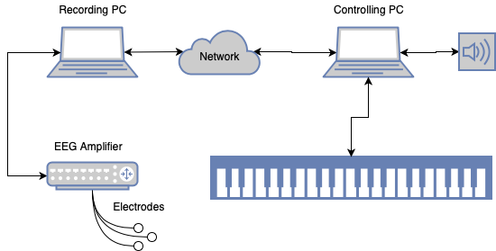

# EMPiano: A System to Enable Expressive Pitch Control on the Piano Keyboard.

This repository contains a system that, in combination with the correct hard- and softwares, offers sound modulation via muscular activity, captured by an electromyography device.

In short: the system is trained to recognize a performed finger gesture and adds a pitch vibrato to the sound output.


##  Requirements

- **Electrodes** and an **Amplifier** to capture the muscle activity. We used the LiveAmp EEG recorder from "Brain Products" (https://www.brainproducts.com/productdetails.php?id=63), to which eight plus one ground and one reference active surface electrodes were connected. An additional Windows PC was needed, because the amplifier program didn't work for MacOS.
- **Lab Streaming Layer (LSL) framework** (https://github.com/sccn/labstreaminglayer)
- Currently **MacBook**, because we make use of the inbuilt MIDI cable (IAC driver); used as the controlling PC
- **Music software**, which is able to receive and play back MIDI. We used the free trial version of Ableton Live 10 (https://www.ableton.com/de/trial/)
- **Electric-Piano**; We used a MIDI-to-USB cable to play the sound through Ableton
- We additionally used **Speakers**, for the purpose of providing a better sound

## Installation

All required packages can be found and installed using the Pipfile.  
The source code itself can be found in the folder "src".

## Setup

### Electrode Setup
The electrodes were placed in two rings around the upper right forearm. Each of the rings counted five electrodes and had to include either ground or reference electrode.


### Hardware Setup


## Steps to Running the System
1. Attach the electrodes to the piano player
2. Run the program that comes with the electrodes
3. Impedance check of the electrodes
4. Start LSL stream
5. Start this python program
6. Connect this program to the LSL stream in the local network
7. Open Ableton or another similar music program
8. Perform Calibration
9. Ready to go!

## Citing Hit the Thumb Jack!

Below are the BibTex entries to cite Hit the Thumb Jack!
```
@inproceedings{10.1145/3357236.3395500,
author = {Karolus, Jakob and Kilian, Annika and Kosch, Thomas and Schmidt, Albrecht and Wozniak, Pawe\l{} W.},
title = {Hit the Thumb Jack! Using Electromyography to Augment the Piano Keyboard},
year = {2020},
isbn = {9781450369749},
publisher = {Association for Computing Machinery},
address = {New York, NY, USA},
url = {https://doi.org/10.1145/3357236.3395500},
doi = {10.1145/3357236.3395500},
booktitle = {Proceedings of the 2020 ACM on Designing Interactive Systems Conference},
pages = {429–440},
numpages = {12},
keywords = {creative support tool, motor tasks, electromyography, seamless integration, expressive piano play},
location = {Eindhoven, Netherlands},
series = {DIS ’20}
}
```