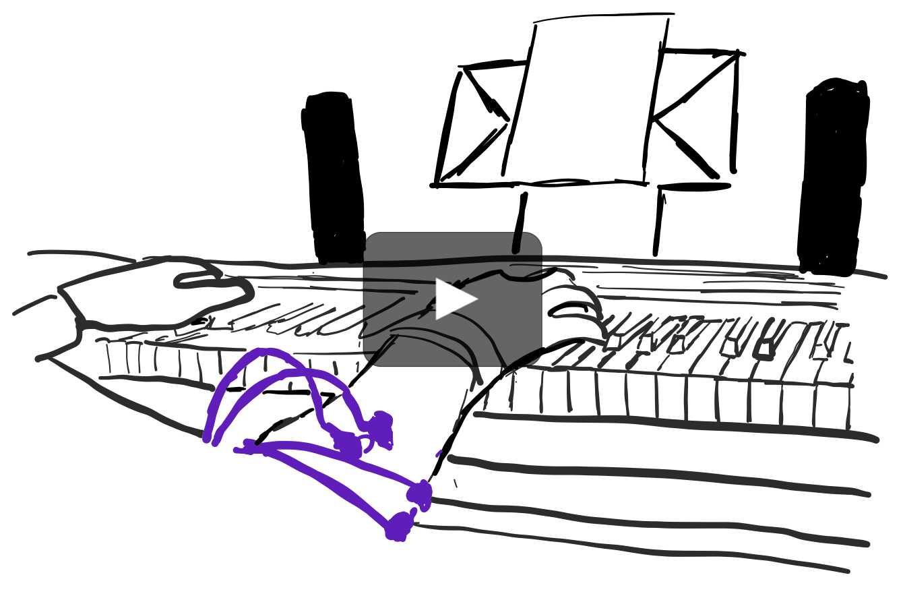

# EMPiano: A System to Enable Expressive Pitch Control on the Piano Keyboard.

This repository contains a system that, in combination with the correct hard- and software, offers sound modulation via 
muscular activity, captured by an electromyography device.

In short: the system is trained to recognize a performed finger gesture (wiggle motion of the thumb) and adds a pitch 
vibrato to the sound output.

[](http://www.jakob-karolus.de/publications/disfp6537-karolus20.mp4)

##  Requirements

- **Electrodes** plus **Amplifier** to capture the muscle activity.  
We used the [LiveAmp EEG recorder](https://www.brainproducts.com/productdetails.php?id=63) from "Brain Products", to 
which eight plus one ground and one reference active surface electrodes were connected.  
The recording software is only available on Windows for us.  
Another set of electrodes we tested was the [**EMBody toolkit**](#EMBody). We used it with two channels.
- [**Lab Streaming Layer (LSL) framework**](#LSL-Stream)  
The RDA Connector can be used to tap the BrainVision data. 
- **Music software**, which is able to receive and play back MIDI, for example [Waveform](#Waveform)
- [**Virtual MIDI cable**](#MIDI), to send messages from the program to the music software.
- **Electric-Piano** 
 We used a MIDI-to-USB cable to play the sound through the music software.
- We additionally used **Speakers**, for the purpose of providing a better sound

## Installation

The easiest way to run this project, is to install <a href="https://pypi.org/project/pipenv/" target="_blank">pipenv</a> 
 on your computer, 
for example by executing ``pip install pipenv``.
Make sure, that you use Python 3. 
Now clone this project and open it in your terminal. With the command ``pipenv install`` all the requirements stated 
in the Pipfile are installed.
And ready to go!

In case you do not want to use the pipenv, you will need to install the following libraries:
   - numpy
   - matplotlib
   - scikit-learn
   - pylsl
   - scipy
   - mido
   - wxpython
   - pubsub


## Setup

### Electrode Setup
The electrodes were placed in two rings around the upper right forearm. Each of the rings counted five electrodes and had to include either ground or reference electrode.  
When using the EMBody toolkit, we attached the reference electrode close to the elbow and the two channels on opposite sides of the upper forearm.

<p align="center">
    
</p>


### Hardware Setup
<p align="center">
    
</p>


## Steps to Running the System
1. Attach the [electrodes](#Setup) to the piano player
2. Start the [LSL-Stream](#LSL-Stream)
3. Start this python program
4. This program will find all available LSL-streams, from these you can choose one to connect to.
5. Prepare [music software](#Waveform)
6. Perform the calibration
7. Ready to go!

## Calibration
Our system offers two different types of calibration.
1. **Video Calibration**:
You are expected to play the shown song in the speed of the blue marker. Whenever this marker hits a note marked in red, you are expected to perform a back-and-forth wiggle motion, using the thumb, for as long as this red note is playing.  
It is possible to reset and restart the video calibration, in case of a mistake.
2. **Custom Calibration**:
You are free to calibrate yourself, by playing whatever and tracking your performance of the back-and-forth wiggle motion by the thumb using the "Mod:on" and "Mod:off" button. With starting the wiggle motion press "Mod:on" and with ending it press "Mod:off" (it is the same button that changes the label after being pressed).  
Here it is also possible to reset and restart the custom calibration, in case of a mistake.

<p align="center"> 
     
</p>

## Best Practices
- 10 electrodes (including Ref und Gnd) around the upper forearm (cf. [Electrode Setup](#Setup))
- Best when using a medical EMG-/EEG-device
- The **finger motion** that works best for our system is a back-and-forth wiggle motion of the **thumb** 
(cf. gif). Feel free to try a sideways wiggle motion or other fingers as well, 
but know that these might not work as well.
- Use a sampling rate of at least 250Hz
- Use a window size of 0.15s for less latency, or for better classification try to use a window size of 0.25s

Not using these practices does not mean the program won't work, it just might not work as smooth or as accurate.


## Additional Information
### LSL-Stream
You can find the library [here](https://github.com/sccn/labstreaminglayer).  
The required LSL-Stream should hold the following information:
- its ID
- name of the stream
- type (can be either EMG or EEG)
- amount of channels (2-8)
- the sampling rate
- format of the data (should be Float32)
- name of the computer the stream is hosted on
- data-samples: ([channel 1, channel 2, ...], timestamp)

### MIDI
For sending MIDI messages from the program to the music software, a virtual MIDI cable is needed.  
In general the mido-library is used to create one during the execution of the program.  
However, this does **not** work together with the Windows MultiMedia API.

If you are on Windows (with the Windows MultiMedia API), you can either use an inbuilt **virtual MIDI cable** (if that exists),
otherwise use [**loopMIDI**](http://www.tobias-erichsen.de/software/loopmidi.html) to create one yourself.  
Please adjust the name of the virtual MIDI cable to use the settings (gui).

### EMBody
EMBody is a data-centric toolkit for rapid prototyping and 
experimentation of EMG-based interfaces.  

The toolkit consists of a hardware prototype that can record electrical potentials (e.g. via surface electrodes), 
convert these in a digital representation, and stream them over an available WiFi connection. 
This is complemented by an accompanying software application, that receives the signal and 
provides an interpretation of the data.  

[This repository](https://github.com/HCUM/embody) contains all the necessary resources to build the system from scratch.

<p align="center">
    
</p>

### Waveform
We used [Waveform 11](https://www.tracktion.com/products/waveform-free), together with the 
[Piano-One](https://neovst.com/piano-one/) instrument.

## Citing "Hit the Thumb Jack!"

Below are the BibTex entries to cite Hit the Thumb Jack!

```
@inproceedings{10.1145/3357236.3395500,
author = {Karolus, Jakob and Kilian, Annika and Kosch, Thomas and Schmidt, Albrecht and Wo\'{z}niak, Pawe\l W.},
title = {Hit the Thumb Jack! Using Electromyography to Augment the Piano Keyboard},
year = {2020},
isbn = {9781450369749},
publisher = {Association for Computing Machinery},
address = {New York, NY, USA},
url = {https://doi.org/10.1145/3357236.3395500},
doi = {10.1145/3357236.3395500},
booktitle = {Proceedings of the 2020 ACM on Designing Interactive Systems Conference},
pages = {429–440},
numpages = {12},
keywords = {creative support tool, motor tasks, electromyography, seamless integration, expressive piano play},
location = {Eindhoven, Netherlands},
series = {DIS ’20}
}
```

```
@misc{karolus:hitthethumb,
  author = {Karolus, Jakob and Kilian, Annika and Kosch, Thomas and Schmidt, Albrecht and Wo\'{z}niak, Pawe\l W.},
  title = {Hit the Thumb Jack!},
  year = {2020},
  publisher = {GitHub},
  journal = {GitHub repository},
  howpublished = {\url{https://github.com/HCUM/empiano}}
}
```
